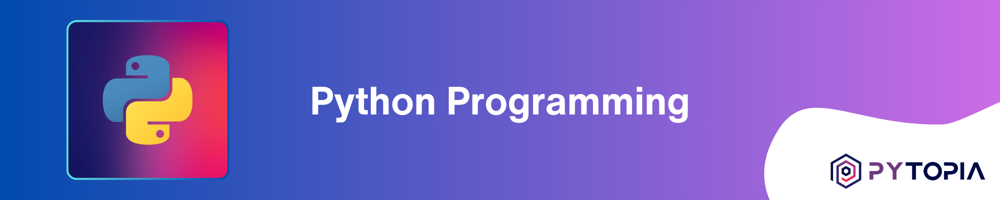
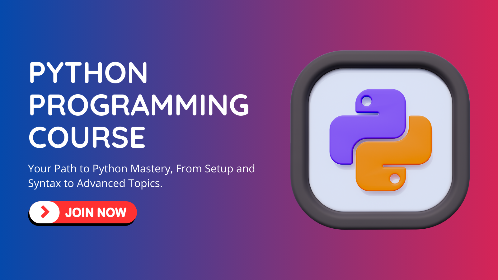

Welcome to our comprehensive Python Course Repository. This course was created with learners in mind, from beginners wanting to dip their toes into the expansive ocean of coding, to seasoned veterans wanting to brush up or expand on their Python knowledge. This course covers a wide range of Python programming concepts, with a keen interaction of theory and practice at every stage.

Our course is neatly divided into several modules:
- **Introduction**: Basic overview of Python and its relevance in today's world.
- **Python Setup**: Guiding learners through the process of installing and setting up Python in their environment.
- **Getting Started**: Beginners' guide to understanding and writing Python code.
- **Data Types**: Overview of the different data types in Python and how to use them.
- **Code Structure and Syntax**: In-depth look into Python's syntax and rules for writing valid code.
- **Control Structures**: Exploring how to manipulate the flow of a Python program using control structures.
- **Functions**: Introduction to functions for writing reusable code.
- **File Handling**: Learning to read, write, and manipulate files using Python.
- **Object-Oriented Programming**: Understanding the fundamental principles of object-oriented programming and its implementation in Python.
- **Modular Programming**: Teaching the concept of writing modular code that's organized and easy to understand.
- **Advanced Topics:** Detailed study of advanced topics such as exception handling, regular expressions, multithreading, etc.
- **Capstone Project**: A practical project that lets learners apply what they've learned over the course.

# 📚 Learn with Us!
We also offer a [course on these projects](https://www.pytopia.ai/courses/python) where learners can interact with peers and instructors, ask questions, and participate in online coding sessions. By registering for the course, you also gain access to our dedicated Telegram group. Enroll now and start learning! Here are some useful links:

- [Python Programming Course](https://www.pytopia.ai/courses/python)
- [Pytopia Public Telegram Group](https://t.me/pytopia_ai)
- [Pytopia Website](https://www.pytopia.ai/)

# 🚦 Getting Started
To start using the projects in this repository:

- Clone the repo to your local machine: `git clone https://github.com/pytopia/python.git`
- Navigate to the specific project directory and Start working on the project using the provided template code and following the project description.

# 🤝 Contributing
We welcome contributions from the community! If you have a project you'd like to add to this repository, please open a pull request. We'll review your project and merge it into the repository if it meets our standards.

# 📞 Contact Information

Feel free to reach out to us!

- 🌐 Website: [pytopia.ia](https://www.pytopia.ai)
- 💬 Telegram: [pytopia_ai](https://t.me/pytopia_ai)
- 🎥 YouTube: [pytopia](https://www.youtube.com/c/pytopia)
- 📸 Instagram: [pytopia.ai](https://www.instagram.com/pytopia.ai)
- 🎓 LinkedIn: [pytopia](https://www.linkedin.com/in/pytopia)
- 🐦 Twitter: [pytopia_ai](https://twitter.com/pytopia_ai)
- 📧 Email: [pytopia.ai@gmail.com](mailto:pytopia.ai@gmail.com)
